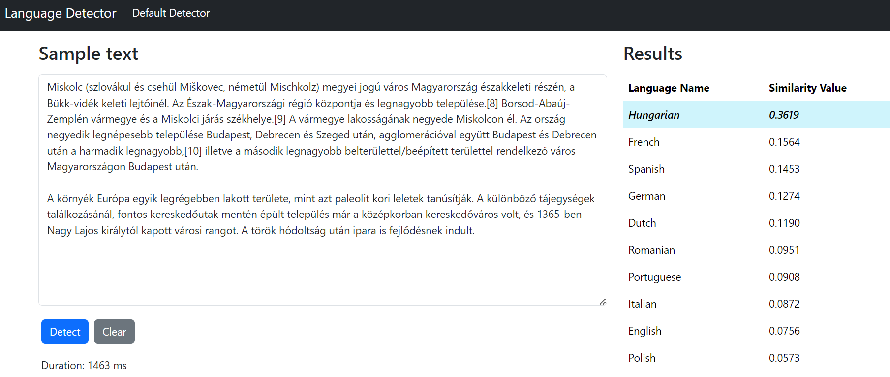

# Language Detector

Playing with language detection, using naive implementation of high-dimensional bipolar vectors.

Background:
- https://web.stanford.edu/class/ee380/Abstracts/171025-slides.pdf
- https://redwood.berkeley.edu/wp-content/uploads/2020/08/JoshiEtAl-QI2016-language-geometry-copy.pdf
